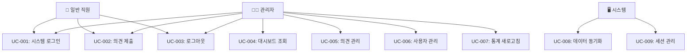

# 열린마음협의회 사용 사례 (Use Cases)

## 📋 목차
1. [문서 개요](#문서-개요)
2. [액터 정의](#액터-정의)
3. [핵심 사용 사례](#핵심-사용-사례)
4. [시나리오별 상세 플로우](#시나리오별-상세-플로우)
5. [예외 상황 처리](#예외-상황-처리)
6. [비즈니스 규칙](#비즈니스-규칙)
7. [시스템 연동](#시스템-연동)

---

## 문서 개요

**열린마음협의회**의 모든 사용 사례를 체계적으로 정리하여 개발팀과 이해관계자들이 시스템의 동작 방식을 명확히 이해할 수 있도록 합니다.

### 기본 정보
- **시스템명**: 열린마음협의회 (Open-Mind Council)
- **목적**: 사내 의견 수집 및 관리 시스템
- **플랫폼**: 웹 기반 반응형 애플리케이션
- **기술 스택**: React + TypeScript, Supabase, MAKE.com

---

## 액터 정의

### 👤 일반 직원 (Employee)
- **역할**: 의견 제출자
- **권한**: 
  - 본인 의견 제출
  - 로그인/로그아웃
- **특징**: OK금융그룹 소속 직원

### 👨‍💼 관리자 (Administrator)
- **역할**: 시스템 관리자
- **권한**:
  - 모든 의견 조회/관리
  - 통계 대시보드 접근
  - 사용자 관리
  - 의견 상태 업데이트
- **특징**: 단일 관리자 체계

### 🖥️ 시스템 (System)
- **역할**: 자동화된 처리
- **기능**:
  - 데이터 검증
  - 실시간 통계 계산
  - 알림 발송
  - 세션 관리

---

## 핵심 사용 사례



---

## 시나리오별 상세 플로우

### UC-001: 시스템 로그인

**액터**: 일반 직원, 관리자  
**목적**: 시스템에 안전하게 접근  
**전제조건**: 유효한 사번과 비밀번호 보유  

#### 📋 기본 플로우
1. **접속**: 사용자가 로그인 페이지(`/login`) 접근
2. **정보 입력**: 사번과 비밀번호 입력
3. **인증 요청**: MAKE.com 웹훅으로 인증 정보 전송
4. **권한 확인**: 시스템이 사용자 권한 확인
5. **세션 생성**: 쿠키 및 localStorage에 사용자 정보 저장
6. **리다이렉트**: 
   - 관리자 → 대시보드(`/dashboard`)
   - 일반 직원 → 의견 제출(`/dashboard#submit`)

#### ⚠️ 예외 플로우
- **E-001-01**: 잘못된 사번/비밀번호
  - Toast 에러 메시지 표시
  - 입력 필드 포커스 이동
- **E-001-02**: 네트워크 오류
  - "연결 상태를 확인해주세요" 메시지
  - 재시도 버튼 제공

---

### UC-002: 의견 제출

**액터**: 일반 직원, 관리자  
**목적**: 회사에 대한 의견이나 제안사항 제출  
**전제조건**: 로그인 상태  

#### 📋 기본 플로우
1. **페이지 접근**: 의견 제출 탭 클릭
2. **폼 렌더링**: 
   - 계열사 드롭다운 (DB에서 동적 로드)
   - 카테고리 드롭다운 (DB에서 동적 로드)
   - 분기 선택 (Q1, Q2, Q3, Q4)
   - 의견 내용 텍스트에리어
3. **정보 입력**: 사용자가 모든 필드 작성
4. **검증**: 클라이언트 사이드 유효성 검사
5. **제출**: MAKE.com 웹훅으로 데이터 전송
6. **확인**: 성공 Toast 메시지 표시
7. **초기화**: 폼 자동 리셋

#### ⚠️ 예외 플로우
- **E-002-01**: 필수 필드 누락
  - 해당 필드에 빨간 테두리
  - "필수 항목을 입력해주세요" 메시지
- **E-002-02**: 의견 내용 길이 초과
  - 글자 수 제한 안내
  - 입력 차단
- **E-002-03**: 제출 실패
  - "다시 시도해주세요" Toast
  - 입력 데이터 보존

---

### UC-003: 로그아웃

**액터**: 일반 직원, 관리자  
**목적**: 안전한 세션 종료  
**전제조건**: 로그인 상태  

#### 📋 기본 플로우
1. **로그아웃 클릭**: 헤더의 로그아웃 버튼 클릭
2. **세션 삭제**: 
   - 쿠키 정보 삭제
   - localStorage 정리
3. **리다이렉트**: 로그인 페이지로 이동
4. **확인**: "로그아웃되었습니다" Toast 메시지

---

### UC-004: 대시보드 조회

**액터**: 관리자  
**목적**: 의견 수집 현황 및 통계 모니터링  
**전제조건**: 관리자 권한으로 로그인  

#### 📋 기본 플로우
1. **페이지 로드**: 대시보드 자동 접근
2. **KPI 카드 렌더링**:
   - 📝 총 의견 수 (실시간)
   - 👥 참여자 수
   - 📊 참여율 계산
   - ⚡ 처리율 표시
3. **차트 생성**:
   - 📈 분기별 의견 추이 (라인 차트)
   - 🥧 카테고리별 분포 (파이 차트)
4. **최근 의견 테이블**:
   - 최신 10건 표시
   - 클릭 시 상세 모달

#### 📊 데이터 소스
- **총 의견/참여자**: `pptkg5i1e54vr7hniw7pnl2xf7m7ccqf` 웹훅
- **처리 현황**: `ud2hqqq4mp42xxsc8k7qfqdpuz4wjqmt` 웹훅
- **카테고리 분포**: `8gxl7a5m79wn5197445pv3tkhk4r4ywk` 웹훅

---

### UC-005: 의견 관리

**액터**: 관리자  
**목적**: 제출된 의견 검토 및 상태 관리  
**전제조건**: 관리자 권한으로 로그인  

#### 📋 기본 플로우
1. **의견관리 탭 접근**: 네비게이션에서 선택
2. **필터 설정**:
   - 🔎 키워드 검색
   - 🏢 계열사별 필터
   - 📂 카테고리별 필터
   - 📅 분기별 필터
   - 🏷️ 처리상태별 필터
3. **의견 목록 조회**: 필터 조건에 맞는 의견 표시
4. **상세보기**: 의견 클릭 → 모달 팝업
5. **상태 업데이트**: 처리상태 변경 (대기→처리중→완료)
6. **저장**: 변경사항 저장 및 알림

#### 🔍 검색 및 필터 기능
```
검색 조건
├── 키워드: 의견 내용 전문 검색
├── 계열사: OK저축은행, OK캐피탈, OK생명 등
├── 카테고리: 업무개선, 복리후생, 교육 등  
├── 분기: Q1, Q2, Q3, Q4
└── 상태: 대기, 처리중, 완료
```

---

### UC-006: 사용자 관리

**액터**: 관리자  
**목적**: 시스템 사용자 현황 파악  
**전제조건**: 관리자 권한으로 로그인  

#### 📋 기본 플로우
1. **사용자관리 탭 접근**: 네비게이션에서 선택
2. **사용자 목록 조회**: 전체 등록 사용자 표시
3. **사용자 카드 정보**:
   - 👤 이름, 사번
   - 🏢 소속 계열사, 부서
   - 📧 이메일 주소
   - 🏷️ 권한 레벨
   - 📊 의견 제출 현황

#### 💳 사용자 카드 구성
```
사용자 카드
├── 아바타 이미지
├── 기본 정보
│   ├── 이름
│   ├── 사번
│   ├── 부서
│   └── 이메일
├── 권한 배지 (user/관리자)
└── 활동 통계
    ├── 제출한 의견 수
    └── 마지막 로그인
```

---

### UC-007: 통계 새로고침

**액터**: 관리자  
**목적**: 실시간 데이터 동기화  
**전제조건**: 대시보드 접근 상태  

#### 📋 기본 플로우
1. **새로고침 버튼 클릭**: 헤더의 🔄 아이콘
2. **로딩 상태**: 스피너 표시
3. **API 재호출**: 모든 통계 데이터 re-fetch
4. **UI 업데이트**: 
   - KPI 카드 갱신
   - 차트 리렌더링
   - 테이블 새로고침
5. **완료 알림**: "업데이트 완료" Toast

#### ⚠️ 예외 플로우
- **E-007-01**: 30초 내 응답 없음
  - 타임아웃 에러 Toast
  - 재시도 옵션 제공

---

### UC-008: 데이터 동기화

**액터**: 시스템  
**목적**: Supabase와 MAKE.com 간 데이터 일관성 보장  
**전제조건**: 네트워크 연결 상태  

#### 📋 자동 동기화 프로세스
1. **실시간 감지**: Supabase Realtime 구독
2. **변경 알림**: 새 의견 제출 시 즉시 반영
3. **캐시 갱신**: React Query 캐시 무효화
4. **UI 업데이트**: 관련 컴포넌트 자동 리렌더링

---

### UC-009: 세션 관리

**액터**: 시스템  
**목적**: 사용자 세션 생명주기 관리  
**전제조건**: 브라우저 환경  

#### 📋 세션 처리 플로우
1. **세션 생성**: 로그인 성공 시
   - 쿠키 만료: 7일
   - localStorage 저장
2. **세션 검증**: 페이지 로드 시마다
3. **자동 연장**: 활동 감지 시
4. **세션 만료**: 
   - 7일 경과 또는 
   - 명시적 로그아웃 시

---

## 예외 상황 처리

### 🚨 시스템 레벨 예외

#### E-SYS-001: 네트워크 연결 오류
- **감지**: API 호출 실패
- **처리**: 
  1. 오프라인 상태 감지
  2. "인터넷 연결을 확인해주세요" 배너 표시
  3. 재연결 시 자동 재시도

#### E-SYS-002: Supabase 서비스 장애
- **감지**: 연속된 API 실패
- **처리**:
  1. 장애 페이지 표시
  2. 서비스 복구 안내
  3. 고객센터 연락처 제공

#### E-SYS-003: 권한 없는 접근
- **감지**: 라우트 가드에서 차단
- **처리**:
  1. 403 에러 페이지
  2. 로그인 페이지로 리다이렉트
  3. "권한이 필요합니다" 메시지

### 💡 사용자 레벨 예외

#### E-USER-001: 잘못된 입력
- **폼 검증 오류**: 실시간 피드백
- **데이터 형식 오류**: 입력 가이드 제공
- **필수 필드 누락**: 시각적 하이라이트

#### E-USER-002: 브라우저 호환성
- **구버전 브라우저**: 업그레이드 안내
- **JavaScript 비활성화**: 활성화 가이드
- **쿠키 차단**: 설정 변경 안내

---

## 비즈니스 규칙

### 📋 의견 제출 규칙
1. **제출 자격**: OK금융그룹 소속 직원만 가능
2. **중복 제출**: 동일 분기 내 카테고리별 1회 제한 없음
3. **내용 제한**: 
   - 최소 10자 이상
   - 최대 1000자 이하
   - 욕설/비방 금지 (클라이언트 필터링)

### 🔐 권한 및 보안
1. **관리자 권한**: 단일 관리자 체계
2. **세션 유효기간**: 7일 (자동 연장)
3. **데이터 접근**: Row-level Security 적용
4. **감사 로그**: 모든 관리자 액션 기록

### 📊 통계 계산 규칙
1. **참여율**: (의견 제출자 수 / 전체 직원 수) × 100
2. **처리율**: (완료 상태 의견 수 / 전체 의견 수) × 100
3. **실시간 업데이트**: 15분 간격 자동 갱신
4. **데이터 보존**: 무제한 (삭제 기능 없음)

---

## 시스템 연동

### 🔗 외부 시스템 연동

#### MAKE.com Webhooks
```
인증 웹훅
├── 엔드포인트: [보안상 비공개]
├── 메서드: POST
├── 데이터: { employeeId, password }
└── 응답: { success, userInfo, role }

의견 제출 웹훅  
├── 엔드포인트: [보안상 비공개]
├── 메서드: POST
├── 데이터: { company, category, quarter, content, userId }
└── 응답: { success, opinionId }

통계 조회 웹훅 (3개)
├── pptkg5i1e54vr7hniw7pnl2xf7m7ccqf (총계)
├── ud2hqqq4mp42xxsc8k7qfqdpuz4wjqmt (처리현황)
└── 8gxl7a5m79wn5197445pv3tkhk4r4ywk (카테고리분포)
```

#### Supabase Integration
```
실시간 구독
├── opinions 테이블 변경사항
├── company_affiliate 마스터 데이터
└── category 마스터 데이터

API 엔드포인트
├── GET /rest/v1/opinions (의견 조회)
├── POST /rest/v1/opinions (의견 등록) 
├── PUT /rest/v1/opinions (상태 업데이트)
└── GET /rest/v1/users (사용자 목록)
```

---

## 성능 및 품질 기준

### ⚡ 성능 요구사항
- **페이지 로드**: 3초 이내
- **API 응답**: 1초 이내
- **차트 렌더링**: 2초 이내
- **검색 결과**: 1초 이내

### 🎯 품질 기준
- **가용성**: 99.5% 이상
- **동시 접속**: 50명 지원
- **데이터 정확도**: 99% 이상
- **브라우저 지원**: Chrome, Edge, Safari 최신 2버전

---

## 📈 현재 구현 현황

### ✅ 완료된 사용 사례
- UC-001: 시스템 로그인 ✅
- UC-002: 의견 제출 ✅  
- UC-003: 로그아웃 ✅
- UC-004: 대시보드 조회 ✅
- UC-005: 의견 관리 ✅
- UC-006: 사용자 관리 ✅
- UC-007: 통계 새로고침 ✅
- UC-008: 데이터 동기화 ✅
- UC-009: 세션 관리 ✅

### 🔄 개선 예정
- 고급 검색 필터 확장
- 일괄 처리 기능 추가
- 모바일 UX 최적화
- 접근성 개선
- 성능 모니터링 강화

---

**최종 업데이트**: 2024년 12월 현재  
**문서 버전**: v1.0  
**작성자**: AI Assistant (PRD & IA 분석 기반)
