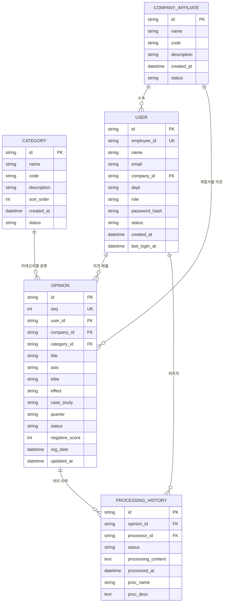
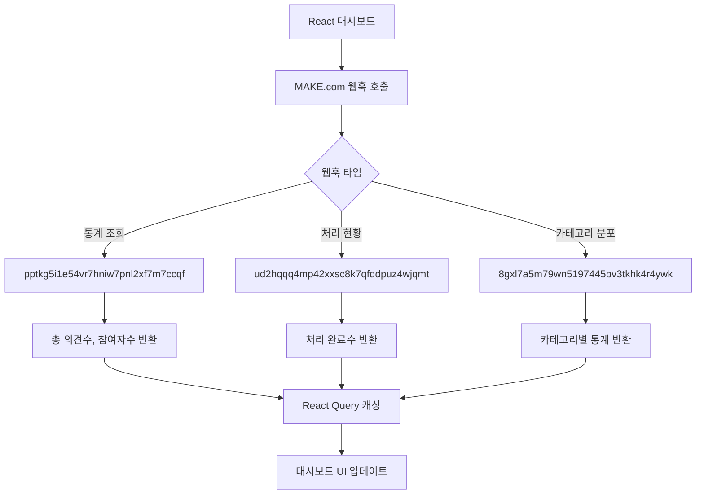
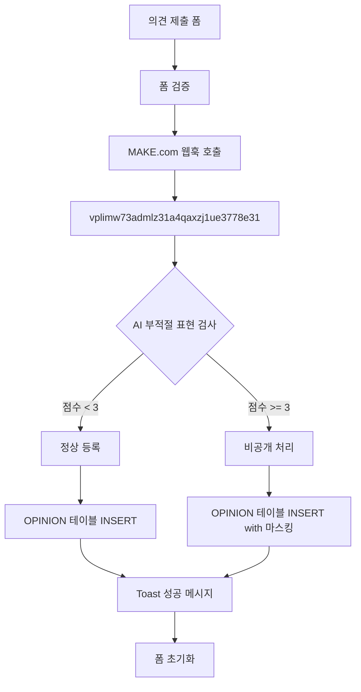
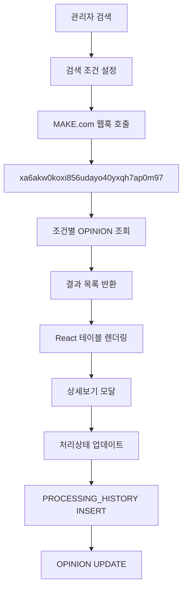

# 열린마음협의회 ERD (Entity-Relationship Diagram)

## 📋 목차
1. [데이터베이스 개요](#데이터베이스-개요)
2. [엔티티 정의](#엔티티-정의)
3. [관계 정의](#관계-정의)
4. [테이블 상세 스키마](#테이블-상세-스키마)
5. [데이터 흐름](#데이터-흐름)
6. [인덱스 설계](#인덱스-설계)
7. [제약조건](#제약조건)
8. [API 매핑](#api-매핑)

---

## 데이터베이스 개요

**열린마음협의회**는 MAKE.com 웹훅을 통해 데이터를 관리하는 하이브리드 아키텍처를 사용합니다.

### 기술 스택
- **데이터 저장**: MAKE.com 통합 플랫폼
- **데이터 처리**: MAKE.com Webhooks
- **프론트엔드**: React + TypeScript
- **상태 관리**: React Query + Local State
- **캐싱**: 브라우저 기반 임시 저장

### 아키텍처 특징
- **서버리스**: 별도 데이터베이스 서버 불필요
- **웹훅 기반**: MAKE.com을 통한 데이터 CRUD
- **실시간 처리**: 웹훅 응답 기반 즉시 반영
- **확장성**: MAKE.com 플랫폼 확장 가능

---

## 엔티티 정의

### 🏢 회사 계열사 (Company Affiliate)
직원이 소속된 계열사 정보를 관리하는 마스터 테이블

### 📂 카테고리 (Category)  
의견의 분류 체계를 관리하는 마스터 테이블

### 👤 사용자 (User)
시스템을 사용하는 직원 및 관리자 정보

### 💭 의견 (Opinion)
직원들이 제출한 의견 및 제안사항의 핵심 데이터

### ⚙️ 처리 이력 (Processing History)
의견에 대한 관리자의 처리 과정 및 결과

---

## 관계 정의



---

## 테이블 상세 스키마

### 🏢 COMPANY_AFFILIATE (계열사 마스터)
| 컬럼명 | 데이터 타입 | 제약조건 | 설명 |
|--------|-------------|----------|------|
| id | VARCHAR(50) | PRIMARY KEY | 계열사 고유 ID |
| name | VARCHAR(100) | NOT NULL | 계열사명 (예: 오케이캐피탈) |
| code | VARCHAR(20) | UNIQUE | 계열사 코드 |
| description | TEXT | NULL | 계열사 설명 |
| created_at | TIMESTAMP | DEFAULT CURRENT_TIMESTAMP | 생성일시 |
| status | VARCHAR(20) | DEFAULT 'active' | 상태 (active/inactive) |

**기본 데이터:**
```sql
INSERT INTO COMPANY_AFFILIATE (id, name, code) VALUES 
('company_01', '오케이캐피탈', 'OKC'),
('company_02', '오케이저축은행', 'OKB'),
('company_03', '오케이데이터시스템', 'OKD'),
('company_04', '기타', 'ETC');
```

### 📂 CATEGORY (카테고리 마스터)
| 컬럼명 | 데이터 타입 | 제약조건 | 설명 |
|--------|-------------|----------|------|
| id | VARCHAR(50) | PRIMARY KEY | 카테고리 고유 ID |
| name | VARCHAR(100) | NOT NULL | 카테고리명 |
| code | VARCHAR(20) | UNIQUE | 카테고리 코드 |
| description | TEXT | NULL | 카테고리 설명 |
| sort_order | INT | DEFAULT 0 | 정렬 순서 |
| created_at | TIMESTAMP | DEFAULT CURRENT_TIMESTAMP | 생성일시 |
| status | VARCHAR(20) | DEFAULT 'active' | 상태 (active/inactive) |

**기본 데이터:**
```sql
INSERT INTO CATEGORY (id, name, code, sort_order) VALUES 
('cat_01', '업무개선', 'WORK_IMPROVE', 1),
('cat_02', '복리후생', 'WELFARE', 2),
('cat_03', '교육/훈련', 'EDUCATION', 3),
('cat_04', '조직문화', 'CULTURE', 4),
('cat_05', '시설환경', 'FACILITY', 5),
('cat_06', '기타', 'ETC', 6);
```

### 👤 USER (사용자)
| 컬럼명 | 데이터 타입 | 제약조건 | 설명 |
|--------|-------------|----------|------|
| id | VARCHAR(50) | PRIMARY KEY | 사용자 고유 ID |
| employee_id | VARCHAR(20) | UNIQUE, NOT NULL | 사번 |
| name | VARCHAR(50) | NOT NULL | 이름 |
| email | VARCHAR(100) | UNIQUE | 이메일 |
| company_id | VARCHAR(50) | FOREIGN KEY | 소속 계열사 ID |
| dept | VARCHAR(100) | NULL | 부서명 |
| role | VARCHAR(20) | DEFAULT 'user' | 권한 (user/admin) |
| password_hash | VARCHAR(255) | NOT NULL | 암호화된 비밀번호 |
| status | VARCHAR(20) | DEFAULT 'active' | 상태 (active/inactive/pending) |
| created_at | TIMESTAMP | DEFAULT CURRENT_TIMESTAMP | 생성일시 |
| last_login_at | TIMESTAMP | NULL | 최종 로그인 일시 |

**관계:**
- company_id → COMPANY_AFFILIATE.id

### 💭 OPINION (의견)
| 컬럼명 | 데이터 타입 | 제약조건 | 설명 |
|--------|-------------|----------|------|
| id | VARCHAR(50) | PRIMARY KEY | 의견 고유 ID |
| seq | INT | UNIQUE, AUTO_INCREMENT | 의견 순번 |
| user_id | VARCHAR(50) | FOREIGN KEY | 제출자 ID |
| company_id | VARCHAR(50) | FOREIGN KEY | 계열사 ID |
| category_id | VARCHAR(50) | FOREIGN KEY | 카테고리 ID |
| title | VARCHAR(200) | NOT NULL | 의견 제목 |
| asis | TEXT | NULL | 현재 상황 (As-Is) |
| tobe | TEXT | NOT NULL | 개선 제안 (To-Be) |
| effect | TEXT | NULL | 기대 효과 |
| case_study | TEXT | NULL | 사례/근거 |
| quarter | VARCHAR(10) | NOT NULL | 분기 (Q1/Q2/Q3/Q4) |
| status | VARCHAR(20) | DEFAULT '접수' | 처리 상태 |
| negative_score | INT | DEFAULT 0 | AI 부적절 표현 점수 (0-10) |
| reg_date | TIMESTAMP | DEFAULT CURRENT_TIMESTAMP | 등록일시 |
| updated_at | TIMESTAMP | ON UPDATE CURRENT_TIMESTAMP | 수정일시 |

**관계:**
- user_id → USER.id
- company_id → COMPANY_AFFILIATE.id  
- category_id → CATEGORY.id

**상태 값:**
- `접수`: 새로 제출된 상태
- `검토중`: 관리자가 검토 시작
- `처리중`: 실제 처리 진행 중
- `처리완료`: 처리 완료
- `보류`: 일시 보류
- `반려`: 처리 불가

### ⚙️ PROCESSING_HISTORY (처리 이력)
| 컬럼명 | 데이터 타입 | 제약조건 | 설명 |
|--------|-------------|----------|------|
| id | VARCHAR(50) | PRIMARY KEY | 처리 이력 고유 ID |
| opinion_id | VARCHAR(50) | FOREIGN KEY | 의견 ID |
| processor_id | VARCHAR(50) | FOREIGN KEY | 처리자 ID |
| status | VARCHAR(20) | NOT NULL | 처리 후 상태 |
| processing_content | TEXT | NULL | 처리 내용 |
| processed_at | TIMESTAMP | DEFAULT CURRENT_TIMESTAMP | 처리일시 |
| proc_name | VARCHAR(50) | NULL | 처리자명 |
| proc_desc | TEXT | NULL | 처리 설명 |

**관계:**
- opinion_id → OPINION.id
- processor_id → USER.id

---

## 데이터 흐름

### 📊 대시보드 데이터 플로우


### ✍️ 의견 제출 플로우


### 🔍 의견 관리 플로우  


---

## 인덱스 설계

### 성능 최적화를 위한 인덱스
```sql
-- 사용자 테이블
CREATE INDEX idx_user_employee_id ON USER(employee_id);
CREATE INDEX idx_user_company_id ON USER(company_id);
CREATE INDEX idx_user_status ON USER(status);

-- 의견 테이블  
CREATE INDEX idx_opinion_user_id ON OPINION(user_id);
CREATE INDEX idx_opinion_company_id ON OPINION(company_id);
CREATE INDEX idx_opinion_category_id ON OPINION(category_id);
CREATE INDEX idx_opinion_quarter ON OPINION(quarter);
CREATE INDEX idx_opinion_status ON OPINION(status);
CREATE INDEX idx_opinion_reg_date ON OPINION(reg_date DESC);
CREATE INDEX idx_opinion_negative_score ON OPINION(negative_score);

-- 복합 인덱스 (자주 사용되는 조합)
CREATE INDEX idx_opinion_quarter_status ON OPINION(quarter, status);
CREATE INDEX idx_opinion_company_category ON OPINION(company_id, category_id);
CREATE INDEX idx_opinion_reg_date_status ON OPINION(reg_date DESC, status);

-- 처리 이력 테이블
CREATE INDEX idx_processing_opinion_id ON PROCESSING_HISTORY(opinion_id);
CREATE INDEX idx_processing_processor_id ON PROCESSING_HISTORY(processor_id);
CREATE INDEX idx_processing_processed_at ON PROCESSING_HISTORY(processed_at DESC);
```

---

## 제약조건

### 데이터 무결성 제약
```sql
-- Check 제약조건
ALTER TABLE USER ADD CONSTRAINT chk_user_role 
    CHECK (role IN ('user', 'admin'));

ALTER TABLE USER ADD CONSTRAINT chk_user_status 
    CHECK (status IN ('active', 'inactive', 'pending'));

ALTER TABLE OPINION ADD CONSTRAINT chk_opinion_quarter 
    CHECK (quarter IN ('Q1', 'Q2', 'Q3', 'Q4'));

ALTER TABLE OPINION ADD CONSTRAINT chk_opinion_status 
    CHECK (status IN ('접수', '검토중', '처리중', '처리완료', '보류', '반려'));

ALTER TABLE OPINION ADD CONSTRAINT chk_opinion_negative_score 
    CHECK (negative_score BETWEEN 0 AND 10);

-- 외래키 제약조건
ALTER TABLE USER ADD CONSTRAINT fk_user_company 
    FOREIGN KEY (company_id) REFERENCES COMPANY_AFFILIATE(id);

ALTER TABLE OPINION ADD CONSTRAINT fk_opinion_user 
    FOREIGN KEY (user_id) REFERENCES USER(id);

ALTER TABLE OPINION ADD CONSTRAINT fk_opinion_company 
    FOREIGN KEY (company_id) REFERENCES COMPANY_AFFILIATE(id);

ALTER TABLE OPINION ADD CONSTRAINT fk_opinion_category 
    FOREIGN KEY (category_id) REFERENCES CATEGORY(id);

ALTER TABLE PROCESSING_HISTORY ADD CONSTRAINT fk_processing_opinion 
    FOREIGN KEY (opinion_id) REFERENCES OPINION(id);

ALTER TABLE PROCESSING_HISTORY ADD CONSTRAINT fk_processing_processor 
    FOREIGN KEY (processor_id) REFERENCES USER(id);
```

---

## API 매핑

### MAKE.com 웹훅 엔드포인트 매핑

| 기능 | 웹훅 URL | HTTP 메서드 | 요청 데이터 | 응답 데이터 |
|------|----------|-------------|-------------|-------------|
| **로그인** | keo7654bc4ppy4sp4bmve6o36v49btdw | POST | `{id, password, timestamp}` | `{user_info, role, success}` |
| **사용자 등록** | 3mk7kus245araqya8shlicy4usqg3eqg | POST | `{company, dept, id, name, email, password}` | `{success, message}` |
| **사용자 목록** | 2ulqdk9j0p42t30a6x62s7urv2c6npmg | POST | `{action: "get_users"}` | `{users: [...]}` |
| **의견 제출** | vplimw73admlz31a4qaxzj1ue3778e31 | POST | `{company, category, title, asis, tobe, effect}` | `{success, opinion_id}` |
| **의견 검색** | xa6akw0koxi856udayo40yxqh7ap0m97 | POST | `{sDate, eDate, company, category, status}` | `{opinions: [...]}` |
| **대시보드 통계** | pptkg5i1e54vr7hniw7pnl2xf7m7ccqf | POST | `{sDate, eDate, limit}` | `{total_cnt, user_cnt, recent_list}` |
| **처리 현황** | ud2hqqq4mp42xxsc8k7qfqdpuz4wjqmt | POST | `{sDate, eDate}` | `{proc_cnt}` |
| **카테고리 분포** | 8gxl7a5m79wn5197445pv3tkhk4r4ywk | POST | `{sDate, eDate}` | `{category_data: [...]}` |

### 웹훅 응답 데이터 구조

#### 대시보드 통계 응답
```typescript
interface DashboardStatsResponse {
  total_cnt: number;        // 총 의견 수
  user_cnt: number;         // 참여자 수  
  recent_list: Array<[      // 최근 의견 목록 (배열 형태)
    number,     // [0] 순번
    string,     // [1] 날짜
    string,     // [2] 계열사
    string,     // [3] 부서
    string,     // [4] 사번
    string,     // [5] 이름
    string,     // [6] 카테고리
    string,     // [7] 제목
    string,     // [8] 현재상황
    string,     // [9] 개선제안
    string,     // [10] 상태
    string,     // [11] 기대효과
    string,     // [12] 사례
    number      // [13] 부적절표현점수
  ]>;
}
```

#### 의견 검색 응답
```typescript
interface OpinionSearchResponse {
  id: string;
  seq: number;
  name: string;
  dept: string;
  company: string;
  category: string;
  title: string;
  asis?: string;
  tobe: string;
  effect?: string;
  case?: string;
  status: string;
  reg_date: string;
  negative_score: number;
  proc_id?: string;
  proc_name?: string;
  proc_desc?: string;
}
```

---

## 보안 및 개인정보 처리

### 데이터 마스킹 규칙
1. **부적절 표현 감지**: AI 점수 3점 이상 시 자동 비공개
2. **개인정보 보호**: 이름을 "OOO"로 마스킹 표시
3. **민감정보 암호화**: 비밀번호 해시 처리

### 접근 제어
- **일반 사용자**: 본인 의견만 조회 가능
- **관리자**: 전체 의견 조회/처리 가능
- **세션 관리**: 쿠키 + localStorage 기반 7일 유효

---

## 확장 고려사항

### 향후 추가 예정 테이블
1. **ATTACHMENT**: 첨부파일 관리
2. **NOTIFICATION**: 알림 이력 관리  
3. **AUDIT_LOG**: 시스템 감사 로그
4. **DEPARTMENT**: 부서 마스터 정보
5. **FEEDBACK**: 의견에 대한 피드백

### 성능 최적화 방안
1. **데이터 아카이빙**: 분기별 데이터 분리 저장
2. **캐싱 전략**: Redis 도입 검토
3. **읽기 전용 복제본**: 조회 성능 향상
4. **API 게이트웨이**: 요청 제한 및 모니터링

---

**최종 업데이트**: 2024년 12월 현재  
**문서 버전**: v1.0  
**작성자**: AI Assistant (소스코드 분석 기반)  
**검토자**: 개발팀
